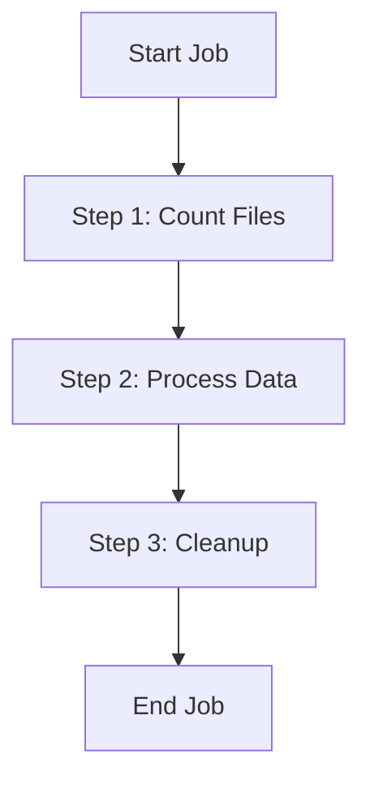
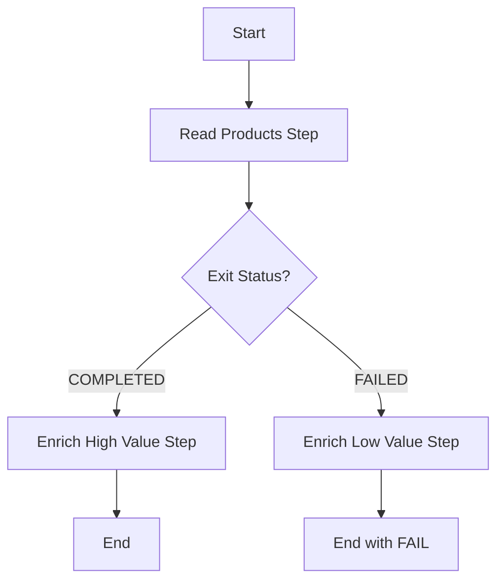
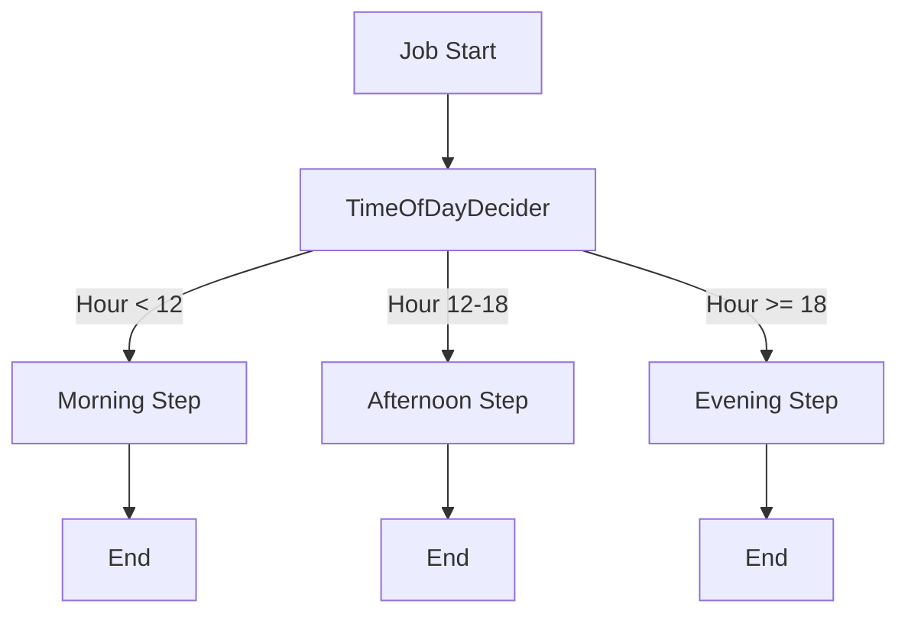
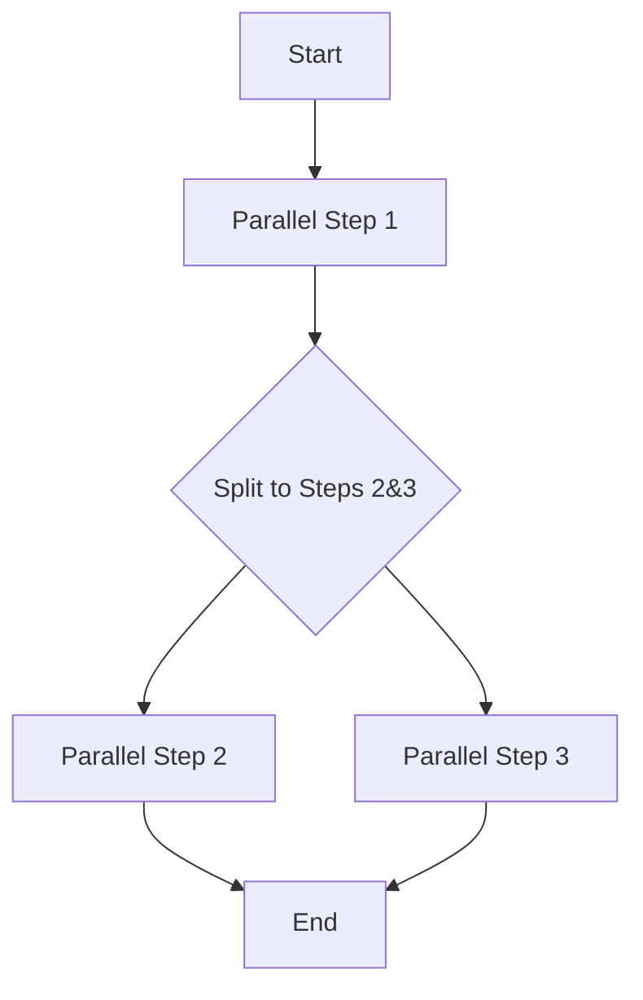
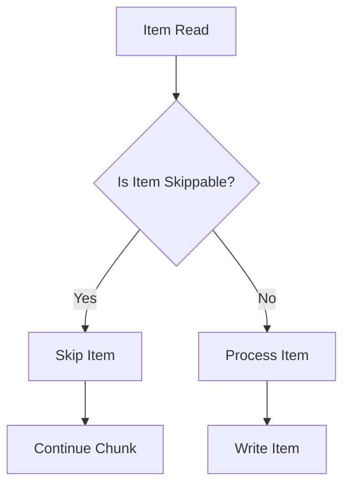
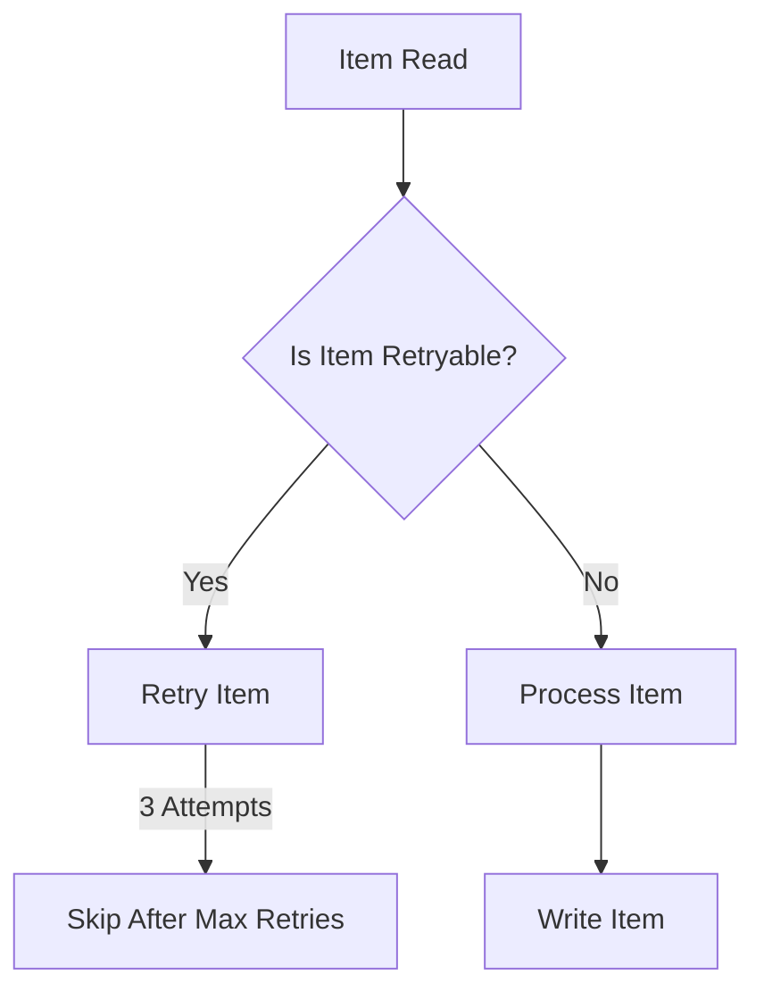
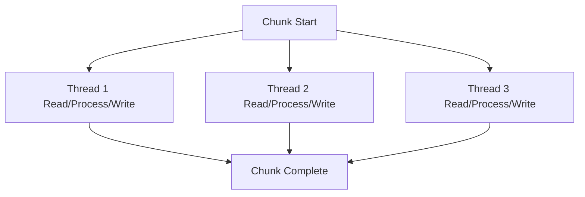
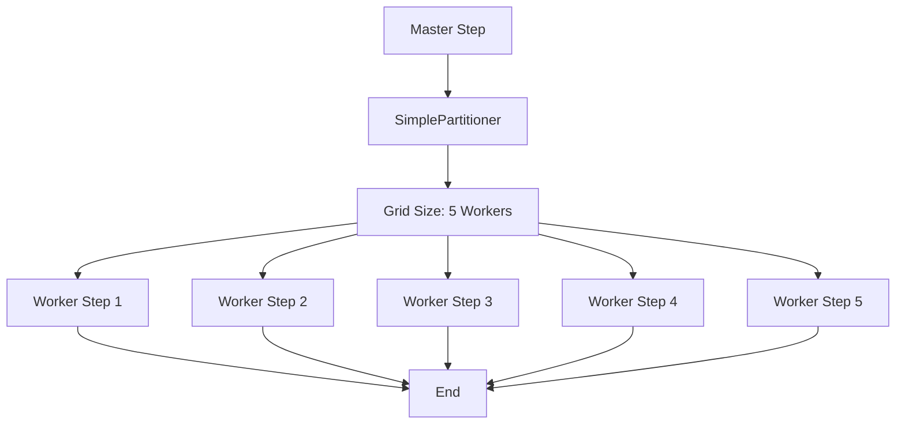

# Spring Batch Management API

A Spring Boot application demonstrating **20+ Spring Batch features** via REST API. Manage, launch, and monitor batch jobs through HTTP endpoints.

## Tech Stack
- **Spring Boot 4.1.1** with Java 25
- **Spring Batch** for batch processing
- **PostgreSQL** (H2 for tests)
- **Maven** build tool
- Actuator endpoints for monitoring

## Features Covered
- 13 Job beans with various flow patterns
- Chunk-oriented processing (Reader → Processor → Writer)
- Fault tolerance (Skip + Retry policies)
- Scalability (Multi-threaded + Partitioning)
- Conditional flows and JobExecutionDeciders
- `@StepScope` and `@JobScope` with SpEL expressions
- Composite and Classifier processors
- 11+ Listener types (Job, Step, Chunk, Item-level)
- Multi-threaded chunk processing
- Task-based partitioning
- REST API with 20+ endpoints
- `@Scheduled` job triggering
- CSV data generation with DataFaker

## Getting Started

### Prerequisites
- Java 25 JDK
- Maven 3.6+
- PostgreSQL (or H2 for tests)

### Run the Application
```bash
cd spring-batch
./mvnw spring-boot:run
```

### Access Endpoints
- **API Base:** `http://localhost:8080/api/batch/`
- **Actuator:** `http://localhost:8080/actuator/`

### Test Endpoints
| Endpoint | Method | Description |
|----------|--------|-------------|
| `/launch` | POST | Launch a job synchronously |
| `/launch-async` | POST | Launch a job asynchronously |
| `/launch-all` | POST | Launch all 12 jobs |
| `/concurrent-test?threadCount=5` | POST | Launch concurrent jobs |
| `/status/{id}` | GET | Get job execution status |
| `/admin/jobs` | GET | List registered jobs |
| `/admin/jobs/{id}` | GET | Get execution details |
| `/admin/stop/{id}` | POST | Stop a running job |

## Spring Batch Concepts

### 1. Job Flow Patterns
- **Sequential Flow:** Steps run one after another (`start().next().next()`)
- **Conditional Flow:** Steps branch based on exit status (`on("COMPLETED").to(...)`)
- **Decider Flow:** `JobExecutionDecider` routes based on time of day
- **Split Flow:** Parallel step execution via `.split()` with thread pool
- **Job Chaining:** Cross-job data via `JobExecution.getExecutionContext()`

### 2. Chunk-Oriented Processing
```
Reader → Processor → Writer
```
- `FlatFileItemReader` reads CSV files
- `JpaItemWriter` writes to database
- Chunk size controls batch commits (e.g., chunk(100))

### 3. Item Readers
- **FlatFile Reader:** Reads CSV with delimited names and FieldSetMapper
- **JDBC Paging Reader:** `JdbcPagingItemReader` with paging and sorting
- **Multi-file Reader:** Factory pattern for different input files

### 4. Item Processors
- **Enrichment:** Add business data (tax, discounts)
- **Filtering:** Return `null` to skip items
- **Validation:** Throw exceptions for invalid data
- **Composite:** Chain multiple processors
- **Classifier:** Route items to different processors based on content type

### 5. Item Writers
- **JPA Writer:** Writes entities to database
- **JSON Writer:** Writes to `output/output.json`
- **Lambda Writers:** Inline anonymous writers

### 6. Fault Tolerance
- **Skip Policy:** `.skipLimit(50).skip(SkippableException.class)`
- **Retry Policy:** `.retryLimit(3).retry(RetryableException.class)`
- **Combined:** Both skip and retry in same job
- **Listeners:** `CustomSkipListener`, `CustomRetryListener` track events

### 7. Scalability
- **Multi-threaded Chunks:** `.taskExecutor()` with ThreadPoolTaskExecutor (core=5, max=10)
- **Partitioning:** Master-worker architecture with `SimplePartitioner`
- **TaskExecutorPartitionHandler:** Controls grid size (5 workers, 4 file workers)
- **Grid Size:** Determines number of parallel worker instances

### 8. Scoping
- **`@StepScope`:** Beans created per step execution (lazy init)
  - Example: `@Value("#{jobParameters['inputSource']}")`
- **`@JobScope`:** Beans created per job execution
  - Example: Track total items written across job lifetime
- **SpEL Expressions:** `#{jobParameters}`, `#{jobExecutionContext}`, `#{stepExecutionContext}`

### 9. Listeners (11+ Types)
- **`@BeforeJob`/`@AfterJob`:** Job-level start/completion
- **`@BeforeStep`/`@AfterStep`:** Step-level start/completion with metrics
- **`@BeforeChunk`/`@AfterChunk`:** Chunk start/end timing
- **`@BeforeRead`/`@AfterRead`/`@OnReadError`:** Item-level read audit
- **`@BeforeWrite`/`@AfterWrite`/`@OnWriteError`:** Item-level write audit
- **`@AfterChunkError`:** Chunk failure handling
- **`SkipListener`:** Track skipped items (read/write/process)
- **`RetryListenerSupport`:** Track retry attempts
- **Context Promotion:** Move data to higher-level context

### 10. Scheduling
- **`@Scheduled(cron = "0 */5 * * * *")`:** Every 5 minutes
- **`@Scheduled(fixedRate = 60000)`:** Every 60 seconds (health check)
- **`@EnableAsync`:** Async job launching via `CompletableFuture`

## REST API Endpoints

### BatchJobController (8 endpoints)
- `POST /launch` - Launch job synchronously
- `POST /launch-async` - Launch job asynchronously  
- `POST /launch-all` - Launch all 12 jobs
- `POST /concurrent-test?threadCount=N` - Concurrent launch test
- `GET /status/{executionId}` - Get execution status
- `GET /jobs` - List registered job names
- `GET /history` - Get launch history
- `GET /stats` - Get request statistics

### FaultToleranceController (3 endpoints)
- `POST /fault-tolerance/skip` - Launch skip job
- `POST /fault-tolerance/retry` - Launch retry job
- `POST /fault-tolerance/skip-retry` - Launch combined job
- `GET /fault-tolerance/jobs` - List fault-tolerance jobs

### ScalabilityController (3 endpoints)
- `POST /scalability/multi-thread` - Launch multi-threaded job
- `POST /scalability/partition` - Launch partitioned job
- `POST /scalability/file-partition` - Launch file partition job
- `GET /scalability/jobs` - List scalability jobs

### AdminController (4 endpoints)
- `GET /admin/jobs` - List jobs with count
- `GET /admin/jobs/{executionId}` - Get execution details
- `POST /admin/stop/{executionId}` - Stop running job
- `GET /admin/stats` - Get total execution statistics

## Database Tables
Spring Batch auto-creates metadata tables:
- `batch_job_instance`
- `batch_job_execution`
- `batch_job_execution_params`
- `batch_step_execution`
- `batch_step_execution_params`
- `batch_job_seq`, `batch_step_seq`, `batch_exec_seq`

Plus 8 entity tables (Employee, Product, Customer, Order, Transaction, Student, ServerLog, Weather)

## CSV Data Generation
The app includes a `CsvFileGenerator` component that generates 100,000-row CSV files for all 8 entity types using DataFaker. Files are in `Csv_Files/` directory.

Generated files:
- `employees_100k.csv`
- `customers_100k.csv`
- `products_100k.csv`
- `orders_100k.csv`
- `transactions_100k.csv`
- `students_100k.csv`
- `server_logs_100k.csv`
- `weather_data_100k.csv`

## Project Structure
```
src/main/java/com/sawmik/spring_batch/
├── config/          # BatchConfig, AsyncConfig, FaultToleranceConfig, ScalabilityConfig
├── entity/          # JPA entities (8 tables)
├── flow/            # Job configurations (Sequential, Conditional, Decider, Split, Chained)
├── listener/        # 11+ listener classes
├── model/           # DTOs
├── processor/       # 6 item processors
├── reader/          # Item readers (FlatFile, JDBC Paging, Multi-file)
├── scope/           # @StepScope, @JobScope config
├── scheduler/       # BatchScheduler with @Scheduled
├── tasklet/         # 3 tasklet implementations
├── util/            # CsvFileGenerator
├── writer/          # JSON file writer
├── exception/       # SkippableException, RetryableException
├── controller/      # 4 REST controllers
├── service/         # BatchAdminService
└── scheduler/       # BatchScheduler
```

## License
MIT License - see LICENSE file

## Spring Batch Flowcharts

### 1. Sequential Job Flow


### 2. Conditional Flow with Exit Status


### 3. JobExecutionDecider (Time-Based Routing)


### 4. Split Flow (Parallel Steps)


### 5. Fault Tolerance: Skip Policy


### 6. Fault Tolerance: Retry Policy


### 7. Multi-threaded Chunk Processing


### 8. Partitioning (Master-Worker)


### 9. @StepScope SpEL Injection
```mermaid
flowchart TD
    A[Step Execution] --> B[@Value("#{jobParameters['inputSource']}")]
    B --> C[ItemReader Created Per Step]
    C --> D[Read Item-1, Item-2, Item-3...]
    D --> E[Step Completes]
```

### 10. @JobScope SpEL Injection
```mermaid
flowchart TD
    A[Job Execution] --> B[@Value Job-Scope Bean]
    B --> C[Total Items Written Counter]
    C --> D[Log Written Count]
    D --> E[Job Completes]
```
